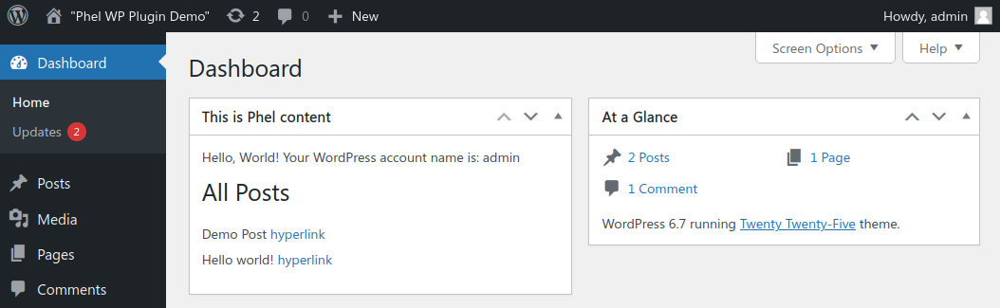

```
, _                          , _     , _
 /|/ \|     _ |\    (|  |  |_//|/ \   /|/ \|\        _, o
  |__/|/\  |/ |/     |  |  |   |__/    |__/|/ |  |  / | | /|/|
  |   |  |/|_/|_/     \/ \/    |       |   |_/ \/|_/\/|/|/ | |_/
                                                     (|
```

WordPress plugin skeleton for [Phel](https://phel-lang.org/), a functional programming language inspired by Clojure and Janet.

Plugin sets up a simple admin widget querying the database and rendering HTML using [Phel HTML library](https://phel-lang.org/documentation/html-rendering/) in way familiar from Clojure [hiccup](https://github.com/weavejester/hiccup).



# Installation
## Development container

For quick testing, a `docker-compose.yml` is included with custom `Dockerfile` that adds some extra tools to the official WordPress image (e.g. Composer, WP-CLI, XDebug). The `custom-entrypoint.sh` sets up the plugin on first run and creates an admin user.

Ensure that the port 8080 is not being exposed to unsafe network from host as the default admin credentials are weak.

Replace `podman` with `docker` in the commands if preferred.

```
git clone git@github.com:jasalt/phel-wp-plugin.git
cd phel-wp-plugin
podman compose up
```

Following success message, access WP admin via http://localhost:8080/wp-admin with credentials user: "admin" password: "password".

For [historical reasons](https://stackoverflow.com/a/32647166) the WordPress container running Apache may occasionally shut down with `caught SIGWINCH, shutting down gracefully` when it's attached to terminal. This can be avoided by running it in the background by using `podman compose up -d`.

## Existing WordPress installation

Requires PHP 8.3+ and Composer.

1) Clone this repository into plugins directory of an existing WordPress installation e.g. `wp-content/plugins/phel-wp-plugin`.
2) Install Composer dependencies `cd phel-wp-plugin && composer install`.
3) Activate plugin on plugin management page or with WP-CLI `wp plugin activate phel-wp-plugin`.

The widget should be visible on admin dashboard. Try editing `src/main.phel` and see changes after page refresh.


# REPL usage
[Phel REPL](https://phel-lang.org/documentation/repl/) starts with `vendor/bin/phel` command. Quick way to connect to into running development container:
```bash
podman compose exec -w /var/www/html/wp-content/plugins/phel-wp-plugin wp vendor/bin/phel
```

Interfacing with the REPL works mostly as expected, examples:
```clojure
(php/require_once "../../../wp-load.php")  ; instantiate WordPress
(get php/$GLOBALS "wpdb")                  ; refer to wpdb for database operations

(require phel\html :refer [html])          ; load Phel core libraries
(require phel-wp-plugin\my-other-ns :as my-other-ns)  # load a Phel source file from src/
(use \Laminas\XmlRpc\Client)               ; load installed Composer PHP libraries
```

Note that to include your own namespaces declared in the plugin directory with `require`, the shell working directory should be set to plugin root directory before starting the REPL.

# Packaging notes

Composer is not required if `vendor` directory is included with the plugin distribution. Note that Composer autoloader does not play very well with WP plugins out-of-box and something like [PHP-Scoper](https://github.com/humbug/php-scoper/) or [Strauss](https://github.com/BrianHenryIE/strauss) is probably required for plugin distribution (see also https://github.com/jasalt/phel-wp-plugin/issues/9).

# Related projects

See also [wp.phel](https://github.com/jasalt/phel-junkshed/blob/master/wp.phel) for some wrapper functions over WP API's and [woocommerce-memberships-migrator](https://github.com/jasalt/woocommerce-memberships-migrator) as a example project (a WP-CLI utility).

# Advanced topics

## `phel-config.php` recommendations

- XDebug's (included with VVV) infinite loop detection gives false positive on default setting and requires `ini_set('xdebug.max_nesting_level', 300);`
- Plugin Phel error log file path is set into plugin dir with `->setErrorLogFile($projectRootDir . 'error.log')`, but this should be changed for production.

## Instantiating WordPress with `wp-load.php` from Phel

WordPress runs `wp-load.php` in beginning of each HTTP request instantiating WordPress Core which loads user plugins including the `phel-wp-plugin.php` which bootstraps Phel by running `Phel::run`.

From a standalone Phel REPL session or a script it can be loaded with `(php/require_once "wp-load.php")`, but this would lead to bootstrapping Phel the second time without some conditional checking in `phel-wp-plugin.php` e.g.

```
// Avoid bootstrapping Phel the second time from REPL session
if (isset($PHP_SELF) && $PHP_SELF !== "./vendor/bin/phel"){
	Phel::run($projectRootDir, 'phel-wp-plugin\main');
} else {
	// This debug print should be removed
	print("Running REPL, skip running plugin Phel::run \n");
}
```
